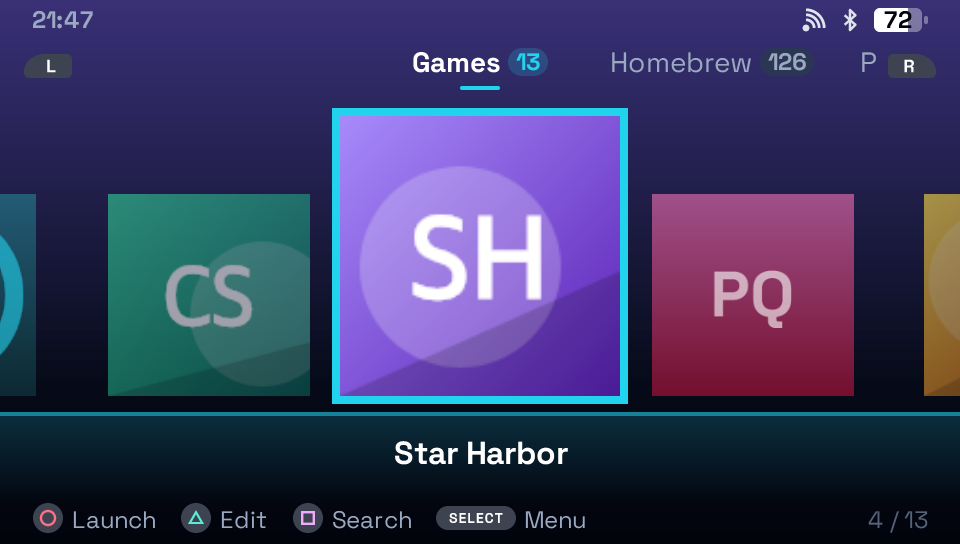
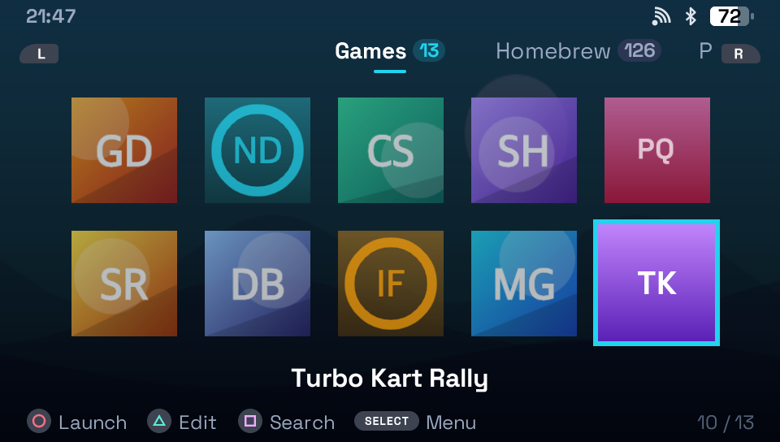
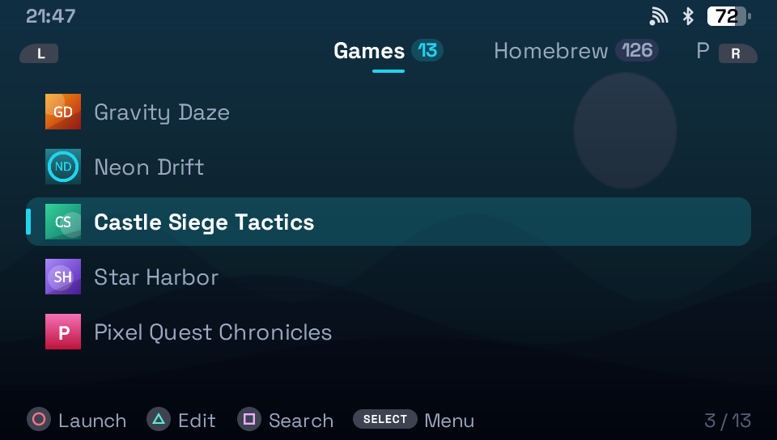
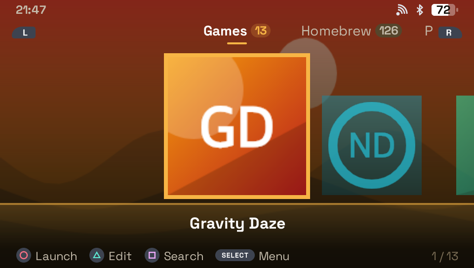
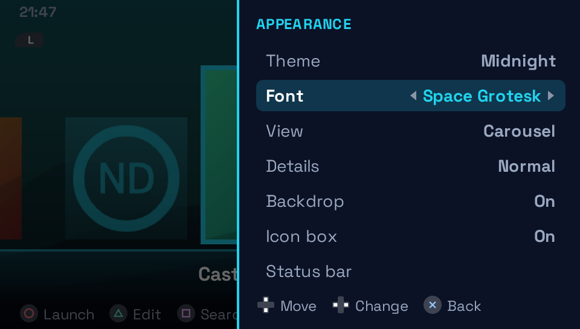

# Pocket Shelf

A launcher for the PS Vita. It lists the titles installed on the console
(Vita games, homebrew, PlayStation Mobile, PSP and PS1 games, and system
applications) in tabs. Each title gets an icon and a backdrop, and it starts
with one button press.

Pocket Shelf is written in TypeScript with Solid and runs on
[PocketJS](https://github.com/pocket-stack/pocketjs). This repository is a fork
of PocketJS: the app lives in [`src/`](./src/), and the rest is the framework
and its Vita host.

- Title id `PBCF7609D`, app id `dev.fthdgn.pocket-shelf`
- Version 0.1.0

<p align="center">
  
</p>

| Grid | List |
| --- | --- |
|  |  |
| **Dynamic theme** | **Menu** |
|  |  |

The screenshots come from `bun run shelf:preview`, which renders the app with
sample titles and generated icons.

## Features

- **Tabs per kind of title:** Games, Homebrew, PS Mobile, PSP, PSX and System,
  with a title count on each. You can add your own categories, and rename,
  reorder or hide any of them. "Last Played" and "Favorites" fill themselves.
- **Three views:** a carousel, a five-column grid and a list. Each has three
  detail levels: Basic, Normal and Detailed.
- **PSP and PS1 games through Adrenaline.** This covers EBOOTs in
  `PSP/GAME` and ISO and CSO images in `ISO`. Pocket Shelf boots the game with
  its own small VSH plugin, so you don't have to pick it in the XMB. Before it
  installs or turns on the plugin, Pocket Shelf asks you.
- **Artwork from [SteamGridDB](https://www.steamgriddb.com/).** You can pick an
  icon and a backdrop for one title, or fetch artwork for a whole category at
  once. This needs your own API key.
- **Search** across every tab with the on-screen keyboard.
- **Per-title changes:** name, category, icon, backdrop and favorite.
- **Six themes:** Midnight, Aurora, Sakura, Ember, Daylight, and Dynamic, which
  takes its colors from the selected title.
- **Status bar** with the clock, Wi-Fi, Bluetooth and battery.
- **Five languages:** English, Turkish, German, French and Spanish.

## Install

1. Download `pocket-shelf.vpk` from
   [Releases](https://github.com/fthdgn-gh/pocket-shelf/releases), or build it
   yourself (see [Building](#building)). Releases come in three channels:
   - **Stable:** tested on hardware.
   - **Beta** (marked pre-release): new features, tested less.
   - **Nightly** (`shelf-nightly`, when available): the current `main`, untested.
2. Copy it to the Vita and install it with VitaShell.
3. Open Pocket Shelf from the home screen. On the first start it scans the
   installed titles and shows its progress. Later starts read the saved list.

After you install or remove a title, run **SELECT ▸ Library ▸ Rescan titles**.

### Adrenaline (PSP and PS1 games)

Both TheOfficialFloW's Adrenaline and isage's fork (8.x) are supported, but
only TheOfficialFloW's has been tested on hardware. The first time you start a
PSP or PS1 game, Pocket Shelf offers to add its plugin to Adrenaline's plugin
list. Nothing changes until you confirm. Adrenaline's own files and settings
are never modified.

### SteamGridDB API key

Create a key in your SteamGridDB profile's preferences. You can type it in the
app, or put it as one line in `ux0:/data/PocketShelf/steamgriddb.txt`.

## Controls

| Button | Action |
| --- | --- |
| D-pad | Move the selection |
| L / R | Previous / next tab |
| ○ or ✕ (your choice in the menu) | Launch / back |
| △ | Edit the selected title |
| □ | Search |
| SELECT | Menu: appearance, library, confirm button, language, diagnostics |

## Data

Everything Pocket Shelf saves is in `ux0:/data/PocketShelf/`:

| File | Holds |
| --- | --- |
| `settings.json` | Settings and the last selection |
| `categories.json` | Your categories and their order |
| `titles/<title id>.json` | Your changes to one title |
| `recent.json` | The last 15 titles started |
| `art/`, `backdrops/` | Downloaded and chosen pictures |
| `titles.tsv` | The scanned title list. Delete it to force a new scan |

## Building

You need [Bun](https://bun.sh/), [Rust via rustup](https://rustup.rs/), and
VitaSDK with the pinned Rust toolchain described in
[`hosts/vita/README.md`](./hosts/vita/README.md).

```sh
bun install
bun run shelf:build:release   # VPK at dist/vita/pocket-shelf.vpk
bun run shelf:run             # debug build, opened in Vita3K
bun run shelf:check           # manifest check and TypeScript
bun run shelf:test            # unit tests
bun run shelf:preview         # render screens to PNG without a Vita
```

Install the release build on hardware. The debug executable is 105 MB, and
the system reads it from the memory card on every launch.

`shelf:preview` needs the `wasm32-unknown-unknown` Rust target. The Adrenaline
plugin is committed as `src/vita/psp/pocketshelf.prx`. To rebuild it after
changing `src/psp-boot/`, run `bun run shelf:plugin`, which needs pspdev.

Notes on the engine limits, host behavior, and what has been verified where are
in [`src/CLAUDE.md`](./src/CLAUDE.md).

### Releases

Three GitHub Actions workflows build and publish the VPK:

| Workflow | Does |
| --- | --- |
| [`shelf-build.yml`](./.github/workflows/shelf-build.yml) | Checks, tests and builds the release VPK. The other two call it; "Run workflow" builds without publishing |
| [`shelf-release.yml`](./.github/workflows/shelf-release.yml) | On a `shelf-v*` tag, publishes a beta or stable release |
| [`shelf-nightly.yml`](./.github/workflows/shelf-nightly.yml) | Replaces the `shelf-nightly` pre-release with a build of `main`, once a day when `main` changed |

The tag's version must be the `version` in `pocket.json`:

```sh
git tag shelf-v0.1.0-beta.1   # beta: published as a pre-release
git tag shelf-v0.1.0          # stable: published as the latest release
git push origin <tag>
```

The nightly schedule is off until the repository variable `SHELF_NIGHTLY` is
set to `true` (Settings ▸ Secrets and variables ▸ Actions ▸ Variables).

## Credits

- [PocketJS](https://github.com/pocket-stack/pocketjs) by Yifeng "Evan" Wang
  and Pocket Nexus: the framework, renderer and Vita host this app is built on.
- [SteamGridDB](https://www.steamgriddb.com/) for the artwork lookups.
- RetroFlow and VitaShell,
  for showing how to launch system applications and PlayStation Mobile titles,
  and how to lay out the LiveArea.

## License

[MIT](./LICENSE), the same as PocketJS. Fonts: Space Grotesk (SIL OFL 1.1),
Hack (MIT) and Inter (SIL OFL, in [`assets/fonts/`](./assets/fonts/)). See
[`src/fonts/NOTICE.md`](./src/fonts/NOTICE.md).
